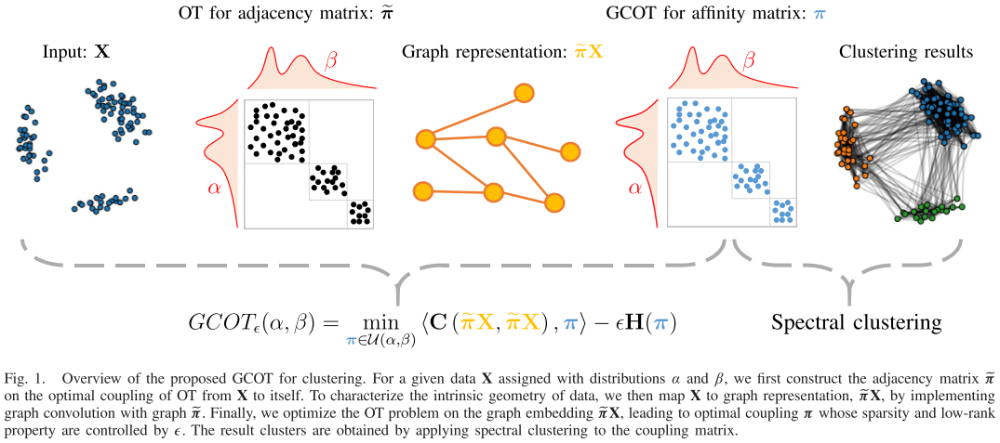

# GCOT: Graph Convolutional Optimal Transport for Hyperspectral Image Spectral Clustering
**This repository is the official open source for GCOT reported by "S. Liu and H. Wang, "Graph Convolutional Optimal Transport for Hyperspectral Image Spectral Clustering," in IEEE Transactions on Geoscience and Remote Sensing, vol. 60, pp. 1-13, 2022, Art no. 4414013, doi: 10.1109/TGRS.2022.3203481."** ([link](https://ieeexplore.ieee.org/document/9874842/))
## Overview of GCOT


## Usage
Install requirements
```
pip3 install -r requirements.txt 
```
Execution 
```
python3 run_gcot.py
```
## Citation

If you find our work helpful in your research, please consider citing:
```
@ARTICLE{liu2022graph,
  author={Liu, Shujun and Wang, Huajun},
  journal={IEEE Transactions on Geoscience and Remote Sensing},
  title={Graph Convolutional Optimal Transport for Hyperspectral Image Spectral Clustering},
  year={2022},
  volume={60},
  pages={1-13}
}
```
